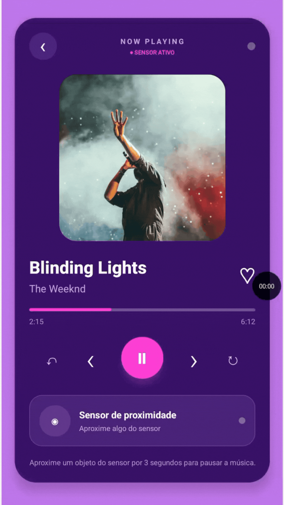

# Sensor de Proximidade

## Curso Técnico de Desenvolvimento de Sistemas - Senai Itapeva

Este projeto é um aplicativo mobile desenvolvido para praticar a integração entre reprodução de áudio e sensores de dispositivos móveis. O usuário pode reproduzir uma música e aproximar um objeto do sensor para pausá-la automaticamente após três segundos.

## Demonstração

O aplicativo apresenta uma interface de player musical com capa, título, artista, barra de progresso, controles de reprodução e indicação visual do estado do sensor. Quando um objeto é detectado, a interface informa a detecção e inicia uma contagem regressiva antes de pausar a música.

<p align="center">
  
</p>

## Funcionalidade Principal: Player Controlado pelo Sensor de Proximidade

### Descrição

Ao iniciar o aplicativo, o sensor de proximidade é verificado e ativado quando está disponível no dispositivo. O usuário pode iniciar ou pausar a música manualmente, reiniciá-la e acompanhar o progresso da reprodução.

Quando o sensor identifica um objeto próximo, o aplicativo inicia uma contagem regressiva de três segundos. Se o objeto permanecer próximo durante esse período, a música é pausada. Caso o objeto se afaste antes do fim da contagem, o processo é cancelado.

Se o dispositivo não possuir um sensor de proximidade compatível, o aplicativo exibe uma tela informando que o recurso está indisponível.

### Desafios e Aprendizados

Para implementar a funcionalidade, foi necessário aprender a verificar a disponibilidade do sensor, ativá-lo e escutar suas alterações com `expo-proximity`.

Também foram praticados o gerenciamento de estado com `useState`, a criação e limpeza de assinaturas com `useEffect`, o controle de `setTimeout` e `setInterval`, a integração com o player de áudio usando `expo-audio` e a atualização visual do progresso da música.

## Visão Geral

O aplicativo foi desenvolvido com React Native, Expo e TypeScript. A aplicação utiliza o Expo Router para organizar a tela principal e um componente reutilizável para concentrar a lógica do player e do sensor de proximidade.

## Funcionalidades

1. **Verificação do sensor**
   - Confere se o dispositivo possui sensor de proximidade.
   - Exibe estados de carregamento, funcionamento e indisponibilidade.

2. **Reprodução de música**
   - Reproduz e pausa a música por meio de um botão principal.
   - Permite reiniciar a música desde o início.
   - Exibe o tempo atual, a duração e a barra de progresso.

3. **Detecção de proximidade**
   - Identifica quando um objeto se aproxima do sensor.
   - Atualiza os indicadores visuais de acordo com o estado detectado.
   - Inicia uma contagem regressiva de três segundos para pausar a música.

4. **Cancelamento automático**
   - Cancela a contagem quando o objeto se afasta.
   - Limpa os temporizadores e a assinatura do sensor ao desmontar o componente.

5. **Interface do player**
   - Apresenta capa, título e artista da música.
   - Mostra o status do sensor e mensagens orientando o usuário.

## Tecnologias Utilizadas

- React Native
- Expo SDK 54
- Expo Router
- TypeScript
- Expo Proximity
- Expo Audio
- React Native Gesture Handler

## Estrutura de Arquivos

```text
sensor_proximidade/
|-- app/
|   |-- _layout.tsx              # Configuração da navegação
|   |-- index.tsx                # Tela principal do aplicativo
|-- components/
|   |-- SensorProximidade.tsx    # Player e controle pelo sensor
|-- assets/
|   |-- images/                  # Ícones e imagens do aplicativo
|-- android/                     # Projeto nativo Android
|-- app.json                     # Configurações do Expo
|-- package.json                 # Dependências e scripts do projeto
|-- tsconfig.json                # Configuração do TypeScript
```

## Como Executar

### Pré-requisitos

- Node.js instalado.
- Android Studio e um dispositivo Android ou emulador configurado para executar a versão nativa.
- Um dispositivo com sensor de proximidade para testar a funcionalidade principal.
- Permissão para reproduzir áudio no dispositivo.

### Instalação

1. Instale as dependências:

```bash
npm install
```

2. Inicie o servidor de desenvolvimento:

```bash
npm start
```

3. Abra o aplicativo usando uma das opções exibidas no terminal ou no painel do Expo.

Também é possível executar diretamente em uma plataforma específica:

```bash
npm run android
npm run ios
npm run web
```

> A versão web e emuladores podem não oferecer a mesma experiência da versão em um dispositivo físico, pois o funcionamento depende do sensor de proximidade.

## Scripts Disponíveis

| Comando                 | Descrição                               |
| ----------------------- | --------------------------------------- |
| `npm start`             | Inicia o servidor do Expo               |
| `npm run android`       | Compila e abre o projeto no Android     |
| `npm run ios`           | Compila e abre o projeto no iOS         |
| `npm run web`           | Executa a versão web                    |
| `npm run lint`          | Verifica problemas de lint              |
| `npm run reset-project` | Reinicia a estrutura inicial do projeto |

## Competências Desenvolvidas

- Desenvolvimento de interfaces mobile com React Native.
- Integração com sensores de dispositivos móveis.
- Reprodução de áudio em uma aplicação Expo.
- Uso de componentes reutilizáveis.
- Gerenciamento de estado com hooks do React.
- Controle de temporizadores e contagens regressivas.
- Criação de interfaces para diferentes estados da aplicação.
- Tipagem e organização de um projeto com TypeScript.

## Autor

Desenvolvido por [Lorena Rinaldo](https://www.linkedin.com/in/lorena-rinaldo01/).
